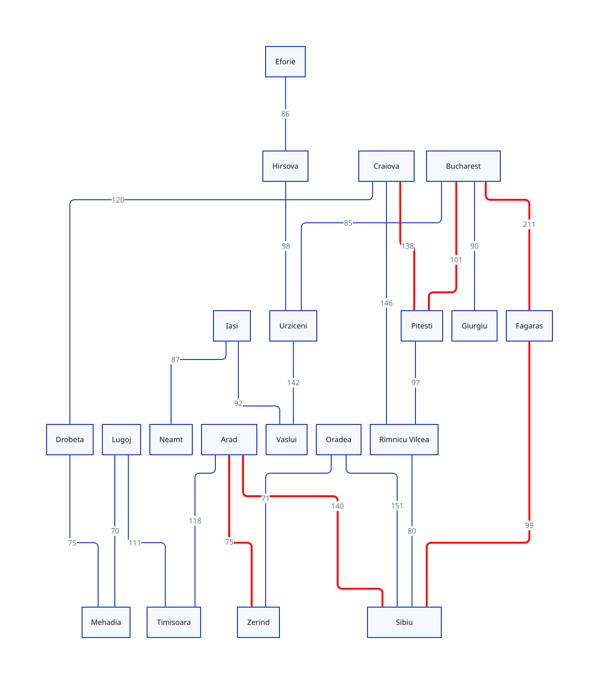
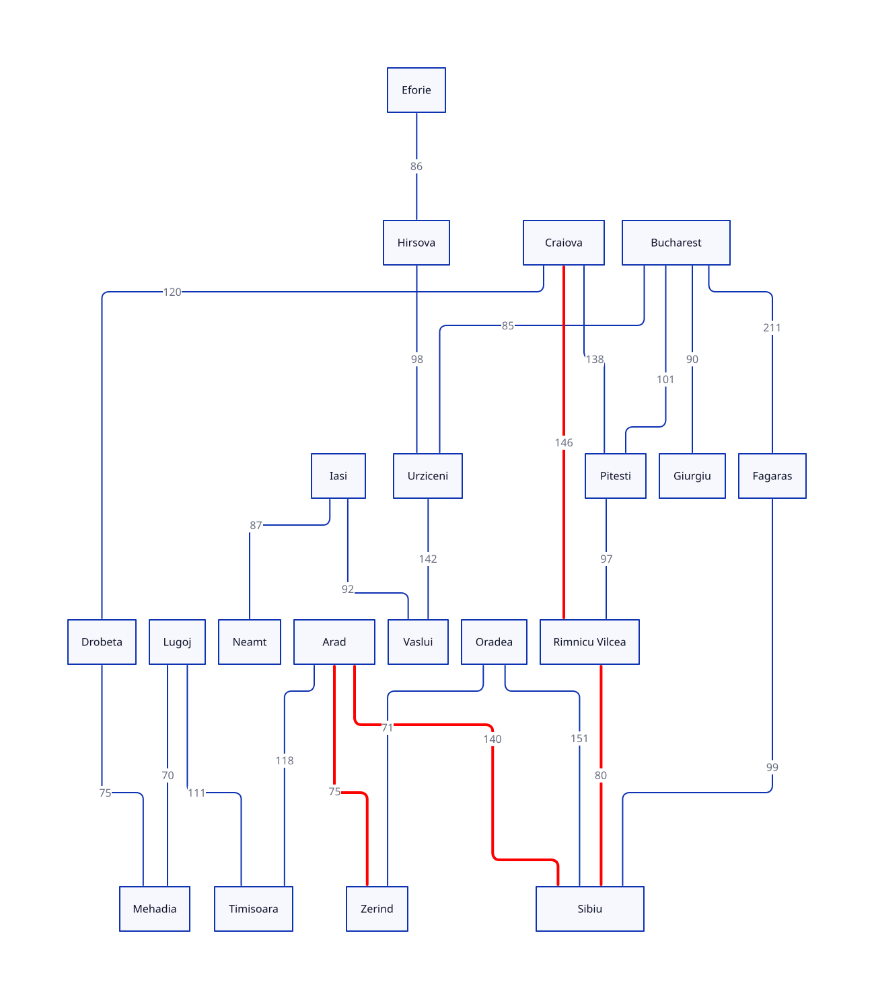

# Reporte

para este ejercicio se eligio la Pareja **Zerind** y **Craiova**

## Pregunnta del Ejercicio

- ¿BFS encontró el camino con **menos carreteras**? ¿UCS el de **menos km**?
Si en ambos casos si, ya que no hubo mejor distancia que **441 km** y que coincidentemente es la ruta con menos carreteras entre ambos poblados

- ¿Por qué DFS puede devolver un camino más largo aunque el grafo sea el mismo?
por que DFS tiende a expandir los nodos inmediatos que tengan menos costo, pero no toma en cuenta el costo del camino completo a la hora de decidir que nodo expandir y pudiera ser que no sea el mas camino completo mas corto y haber encontrado el nodo final.

- ¿Con qué `--limit` DLS pasó de `cutoff` a solución, y cómo se relaciona eso con la profundidad del camino de BFS/IDS?
con limite de 4. pues que si BFS e IDS tuvieran ese limite ninguno de de esos algoritmos tampoco encontraria el camino mas optimo.

- ¿IDS coincide con BFS en profundidad (número de carreteras)?
Si

- ¿qué pasó con DLS en el límite bajo (`cutoff`) frente al límite suficiente.?
Nunca pudo encointrar el camino que cumpliera con als caracteristicas reqeuridas, ya que el camino minimo viable se encontraba a una profundidad de 4

## Tabla comparativa

| Algorithm | Path                                                            | Depth   | Cost   | Expanded  | Status      |
|-----------|-----------------------------------------------------------------|---------|--------|-----------|-------------|
| BFS       | Zerind → Arad → Sibiu → Rimnicu Vilcea → Craiova                | 4 roads | 441 km |  7 nodes  | success     |
| UCS       | Zerind → Arad → Sibiu → Rimnicu Vilcea → Craiova                | 4 roads | 441 km |  10 nodes | success     |
| DFS       | Zerind → Arad → Sibiu → Fagaras → Bucharest → Pitesti → Craiova | 6 roads | 764 km |  7 nodes  | success     |
| DLS lim 2 |                                                                 |         |        |  3 nodes  | **cut-off** |
| DLS lim 4 | Zerind → Arad → Sibiu → Rimnicu Vilcea → Craiova                | 4 roads | 441 km |  6 nodes  | success     |
| IDS       | Zerind → Arad → Sibiu → Rimnicu Vilcea → Craiova                | 4 roads | 441 km |  16 nodes | success     |
|-----------|-----------------------------------------------------------------|---------|--------|-----------|-------------|

## Subgrafos seleccionados por los algoritmos




## Evidencia de Ejecución

```zsh
inteligencia-artificial/Búsqueda no informada/project on  main [?] via 🐍 3.14.7 via project
➜ python 02_breadth_first_search.py --from-city Zerind --to Craiova
Algorithm: Breadth-first search
Problem:   Zerind → Craiova
Status:    success
Path:      Zerind → Arad → Sibiu → Rimnicu Vilcea → Craiova
Depth:     4 roads
Cost:      441 km
Expanded:  7 nodes
Generated: 17 nodes
Frontier:  max size 3

inteligencia-artificial/Búsqueda no informada/project on  main [?] via 🐍 3.14.7 via project
➜ python 03_uniform_cost_search.py --from-city Zerind --to Craiova
Algorithm: Uniform-cost search
Problem:   Zerind → Craiova
Status:    success
Path:      Zerind → Arad → Sibiu → Rimnicu Vilcea → Craiova
Depth:     4 roads
Cost:      441 km
Expanded:  10 nodes
Generated: 26 nodes
Frontier:  max size 4

inteligencia-artificial/Búsqueda no informada/project on  main [?] via 🐍 3.14.7 via project
➜ python 04_depth_first_search.py --from-city Zerind --to Craiova
Algorithm: Depth-first search
Problem:   Zerind → Craiova
Status:    success
Path:      Zerind → Arad → Sibiu → Fagaras → Bucharest → Pitesti → Craiova
Depth:     6 roads
Cost:      764 km
Expanded:  7 nodes
Generated: 20 nodes
Frontier:  max size 6

inteligencia-artificial/Búsqueda no informada/project on  main [?] via 🐍 3.14.7 via project
➜ python 05_depth_limited_search.py --from-city Zerind --to Craiova --limit 2
Algorithm: Depth-limited search
Problem:   Zerind → Craiova
Status:    cutoff
Detail:    limit=2
Expanded:  3 nodes
Generated: 8 nodes
Frontier:  max size 5

inteligencia-artificial/Búsqueda no informada/project on  main [?] via 🐍 3.14.7 via project
➜ python 05_depth_limited_search.py --from-city Zerind --to Craiova --limit 5
Algorithm: Depth-limited search
Problem:   Zerind → Craiova
Status:    success
Detail:    limit=5
Path:      Zerind → Arad → Sibiu → Rimnicu Vilcea → Craiova
Depth:     4 roads
Cost:      441 km
Expanded:  7 nodes
Generated: 16 nodes
Frontier:  max size 9

inteligencia-artificial/Búsqueda no informada/project on  main [?] via 🐍 3.14.7 via project
➜ python 05_depth_limited_search.py --from-city Zerind --to Craiova --limit 4
Algorithm: Depth-limited search
Problem:   Zerind → Craiova
Status:    success
Detail:    limit=4
Path:      Zerind → Arad → Sibiu → Rimnicu Vilcea → Craiova
Depth:     4 roads
Cost:      441 km
Expanded:  6 nodes
Generated: 12 nodes
Frontier:  max size 7

inteligencia-artificial/Búsqueda no informada/project on  main [?] via 🐍 3.14.7 via project
➜ python 06_iterative_deepening_search.py --from-city Zerind --to Craiova
Algorithm: Iterative deepening search
Problem:   Zerind → Craiova
Status:    success
Detail:    last_limit=4
Path:      Zerind → Arad → Sibiu → Rimnicu Vilcea → Craiova
Depth:     4 roads
Cost:      441 km
Expanded:  16 nodes
Generated: 42 nodes
Frontier:  max size 7
```