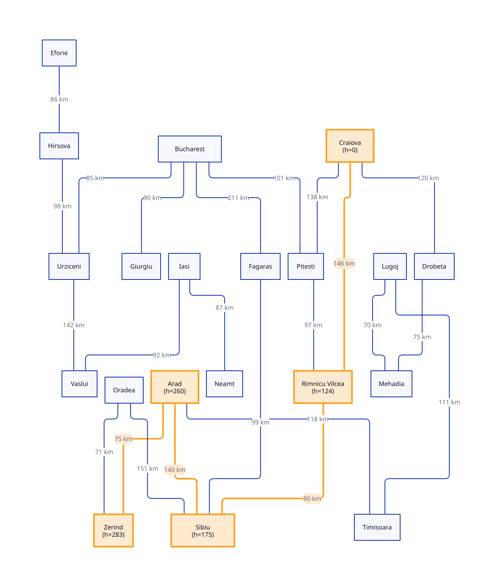
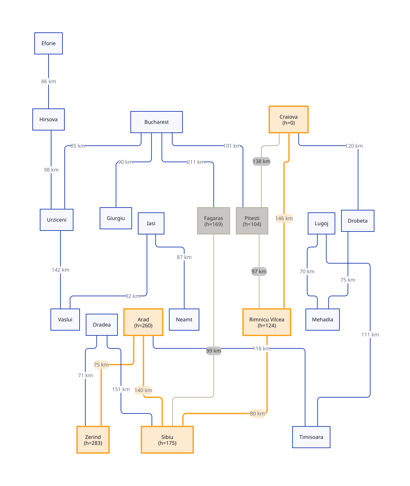

# Reporte

para este ejercicio se eligio la Pareja **Zerind** y **Craiova**

## Pregunta del Ejercicio

- ¿Greedy y A* devolvieron el **mismo** camino o no, y por qué?

Si devuelven lo mismo pero por razones distintas, Greedy hizo 4 expansiones y acertó por suerte del heurístico: nunca verificó si otra ruta con más g inicial pero mejor f total podía ser más corta.
A* hizo 6 expansiones porque insistió en confirmar que ningún nodo pendiente (Oradea) pudiera aún abrir un camino más barato, antes de aceptar Craiova como solución.

- qué heurística se usó (tabla AIMA vs. euclidiana);
euclidiana

- en al menos un punto de decisión, cómo `h(n)` (Greedy) frente a `f(n) = g(n) + h(n)` (A*) explica la ciudad que cada algoritmo expandió.

Al llegar al 4to punto Greedy ve directamente a a `Craiova` y directamente asume que es la ruta mas cercana por la heuristica de las distancias euclidianas Y AStar decide verificar en otro nodo a ver si se enucntra una mejor ruta (`Pitesti`) y al no encontrar una distancia mas corta entonces asume que el camino `Craiova` que encontro en `Rimnicu Vilcea` era la mas corta.

## Tabla comparativa

| Algorithm | Path                                                 | Depth | Cost | Expanded |
|-----------|------------------------------------------------------|-------|------|----------|
| Greedy    | Zerind → Arad → Sibiu → Rimnicu Vilcea → Craiova     |   4   | 441  |   4      |
| A* Search | Zerind → Arad → Sibiu → Rimnicu Vilcea → Craiova     |   4   | 441  |   7      |

## Subgrafos seleccionados por los algoritmos

### Greedy



### A-Star



## Evidencia de Ejecución

```cmd
(venv) C:\Users\9AWCJ\projects\inteligencia-artificial\Búsqueda informada\project>python 02_heuristics.py --from-city Zerind --to Craiova
Heuristic: Euclidean distance to Craiova (map coordinates)

  h(n)  city
      0  Craiova  <- goal
     89  Drobeta
     99  Mehadia
    104  Pitesti
    123  Giurgiu
    124  Rimnicu Vilcea
    127  Lugoj
    152  Bucharest
    169  Fagaras
    175  Sibiu
    200  Timisoara
    212  Urziceni
    260  Arad
    283  Zerind  <- start
    288  Hirsova
    292  Neamt
    300  Vaslui
    308  Oradea
    309  Eforie
    310  Iasi

(venv) C:\Users\9AWCJ\projects\inteligencia-artificial\Búsqueda informada\project>python 03_greedy_best_first_search.py --from-city Zerind --to Craiova
Algorithm: Greedy best-first search
Problem:   Zerind → Craiova
Heuristic: Euclidean distance to Craiova (map coordinates)
Status:    success
Path:      Zerind → Arad → Sibiu → Rimnicu Vilcea → Craiova
Depth:     4 roads
Cost:      441 km

  city                  g     h     f
  Zerind                   0   283   283
  Arad                    75   260   335
  Sibiu                  215   175   390
  Rimnicu Vilcea         295   124   419
  Craiova                441     0   441

Expanded:  4 nodes
Generated: 13 nodes
Frontier:  max size 5

(venv) C:\Users\9AWCJ\projects\inteligencia-artificial\Búsqueda informada\project>python 04_a_star_search.py --from-city Zerind --to Craiova
Algorithm: A* search
Problem:   Zerind → Craiova
Heuristic: Euclidean distance to Craiova (map coordinates)
Status:    success
Path:      Zerind → Arad → Sibiu → Rimnicu Vilcea → Craiova
Depth:     4 roads
Cost:      441 km

  city                  g     h     f
  Zerind                   0   283   283
  Arad                    75   260   335
  Sibiu                  215   175   390
  Rimnicu Vilcea         295   124   419
  Craiova                441     0   441

Expanded:  7 nodes
Generated: 19 nodes
Frontier:  max size 4
```
