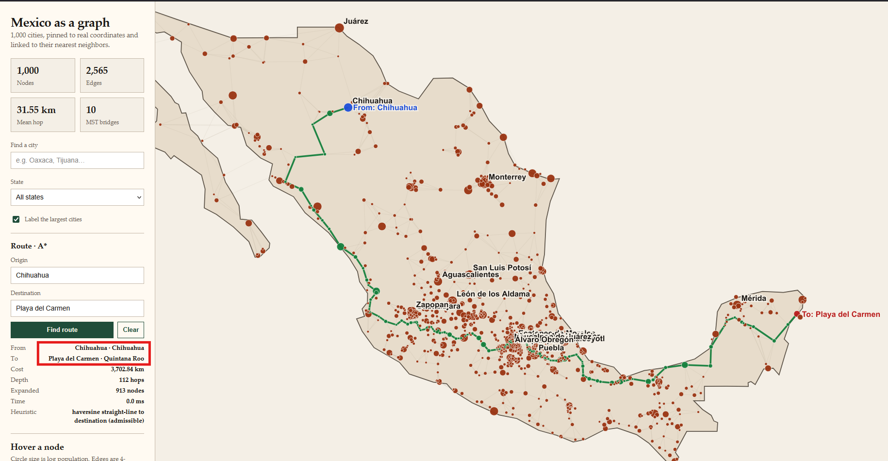
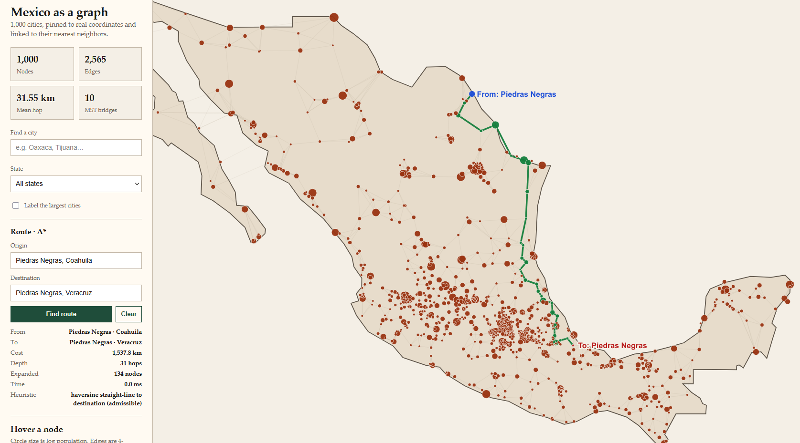

# Reporte ejercicio 2

## Preguntas

- ¿Qué usaste como estado (¿nombre? ¿id? ¿nombre + estado?) y cómo resolviste duplicados.?

Se usa el id, como esta garantizado que es unico resulta menos problematico

Los duplicados no se estan admitiendo en tiempo de ejecucion, cuando un nombre es ambiguo se solicita que ponga el estado al que pertenece y en ultima instancia el id del nodo.

- ¿Por qué haversine es admisible aquí.?

por que todas las distancias y heuristicas estan dados en distancias harversine, ademas se trata de distancias geodesicas, que es precisamente el escenario en donde se aplican este tipo de distancias

- ¿Costo en km y número de hops de tu ruta larga, y cuántos nodos expandió A*?

El costo fue de 3702.8 km, 112 hops y 913 nodos expandio

## Evidencia



```cmd
C:\Users\9AWCJ\projects\ejercicios_mia\04_busqueda_informada\ejercicio_2\Mexico map>python find_route.py --from-city "Chihuahua" --to "Playa del Carmen"
Algorithm: A* search
Problem:   Chihuahua → Playa del Carmen
Heuristic: haversine straight-line km to Playa del Carmen
Status:    success
Path:      Chihuahua → Cuauhtémoc, Chihuahua → San Juanito → Guachochi → Choix → Adolfo Ruíz Cortínes → Guamúchil → General Ángel Flores (La Palma) → 
Licenciado Benito Juárez (Campo Gobierno) → El Rosario, Sinaloa (2) → La Cruz → Mazatlán → Escuinapa → Tecuala → Tuxpan, Nayarit → Villa Hidalgo, Nayarit → 
Tepic → Xalisco → Las Varas → San Juan de Abajo → Ixtapa, Jalisco → Mascota → El Salto, Jalisco (1) → Tecolotlán → Cocula → Zacoalco de Torres → Jocotepec → Ajijic → 
Chapala → San José de Gracia → Sahuayo de Morelos → Pajacuarán → Santiago Tangamandapio → Jacona de Plancarte → Tangancícuaro de Arista → Purépero de Echáiz → Zacapu → 
Quiroga → Conjunto Habitacional Villas del Pedregal → Fraccionamiento Misión del Valle → Álvaro Obregón, Michoacán → Zinapécuaro → Ciudad Hidalgo, Michoacán → 
Heróica Zitácuaro → Valle de Bravo → San Juan de las Huertas → San Buenaventura, México → San Francisco Cuaxusco → San Salvador Tizatlalli → San Mateo Atenco → 
Lerma de Villada → Santa María Atarasquillo → Huixquilucan → San Francisco Chimalpa → Naucalpan de Juárez → Tlalnepantla → Buenavista → Fuentes del Valle → 
San Pablo de las Salinas → Ojo de Agua → San Martín Azcatepec → Teotihuacán de Arista → Otumba → Ciudad Sahagun → Emiliano Zapata, Hidalgo → Ciudad de Nanacamilpa → 
San Rafael Tlanalapan → Santa Ana Xalmimilulco → San Miguel Xoxtla → Xicohtzinco → Papalotla → Villa Vicente Guerrero → Santa María Xonacatepec → 
Tepatlaxco de Hidalgo → Tepeaca → Huixcolotla → Tlaixpan → Palmarito Tochapan → Xaltepec → Cuacnopalan → Maltrata → Orizaba → Ixtaczoquitlán → Córdoba → 
Paso del Macho → Soledad de Doblado → Piedras Negras, Veracruz → La Isla → Tres Valles → Loma Bonita → Isla → Juan Rodríguez Clara → Acayucan → Oteapan → 
Minatitlán → Ixhuatlán del Sureste → Villa la Venta → Cárdenas, Tabasco → Cunduacán → Jalpa de Méndez → Frontera, Tabasco → Ciudad del Carmen → Escárcega → 
Champotón → Pomuch → Calkiní → Muna → Oxkutzkab → Akil → Peto → Felipe Carrillo Puerto, Quintana Roo → Tulum → Playa del Carmen
Depth:     112 hops
Cost:      3702.8 km

  city                                            g       h       f
  Chihuahua                                     0.0  2114.0  2114.0
  Cuauhtémoc, Chihuahua                        79.7  2176.6  2256.3
  San Juanito                                 166.9  2230.5  2397.4
  Guachochi                                   305.2  2145.7  2450.9
  Choix                                       430.0  2263.4  2693.5
  Adolfo Ruíz Cortínes                        544.8  2283.9  2828.7
  Guamúchil                                   619.6  2211.9  2831.5
  General Ángel Flores (La Palma)             702.4  2158.9  2861.3
  Licenciado Benito Juárez (Campo Gobierno)   723.7  2145.2  2868.9
  El Rosario, Sinaloa (2)                     781.4  2103.0  2884.4
  La Cruz                                     828.8  2069.4  2898.3
  Mazatlán                                    920.0  2012.9  2932.9
  Escuinapa                                   998.2  1945.5  2943.8
  Tecuala                                    1056.7  1910.2  2966.8
  Tuxpan, Nayarit                            1109.9  1892.2  3002.1
  Villa Hidalgo, Nayarit                     1133.3  1884.9  3018.2
  Tepic                                      1176.5  1850.2  3026.7
  Xalisco                                    1183.0  1850.5  3033.5
  Las Varas                                  1221.9  1875.6  3097.5
  San Juan de Abajo                          1263.0  1882.8  3145.7
  Ixtapa, Jalisco                            1274.0  1884.7  3158.7
  Mascota                                    1322.3  1842.5  3164.8
  El Salto, Jalisco (1)                      1359.1  1814.0  3173.2
  Tecolotlán                                 1408.6  1768.1  3176.6
  Cocula                                     1438.3  1743.3  3181.5
  Zacoalco de Torres                         1468.8  1718.0  3186.8
  Jocotepec                                  1484.7  1703.0  3187.7
  Ajijic                                     1503.0  1684.7  3187.7
  Chapala                                    1509.6  1678.2  3187.8
  San José de Gracia                         1548.0  1663.3  3211.4
  Sahuayo de Morelos                         1580.9  1630.8  3211.7
  Pajacuarán                                 1597.9  1614.7  3212.6
  Santiago Tangamandapio                     1620.7  1602.6  3223.3
  Jacona de Plancarte                        1634.0  1589.4  3223.4
  Tangancícuaro de Arista                    1646.8  1579.5  3226.4
  Purépero de Echáiz                         1667.9  1558.5  3226.4
  Zacapu                                     1692.6  1536.9  3229.5
  Quiroga                                    1725.5  1511.0  3236.5
  Conjunto Habitacional Villas del Pedregal  1748.5  1488.0  3236.5
  Fraccionamiento Misión del Valle           1769.6  1468.0  3237.7
  Álvaro Obregón, Michoacán                  1780.2  1458.9  3239.1
  Zinapécuaro                                1802.7  1436.5  3239.2
  Ciudad Hidalgo, Michoacán                  1836.9  1409.9  3246.9
  Heróica Zitácuaro                          1872.1  1393.0  3265.1
  Valle de Bravo                             1907.9  1373.4  3281.3
  San Juan de las Huertas                    1947.5  1333.8  3281.3
  San Buenaventura, México                   1956.7  1324.6  3281.3
  San Francisco Cuaxusco                     1962.4  1319.0  3281.4
  San Salvador Tizatlalli                    1965.4  1316.2  3281.6
  San Mateo Atenco                           1971.7  1310.0  3281.6
  Lerma de Villada                           1974.9  1307.5  3282.3
  Santa María Atarasquillo                   1981.1  1302.4  3283.5
  Huixquilucan                               1994.1  1289.6  3283.6
  San Francisco Chimalpa                     2003.3  1287.6  3290.9
  Naucalpan de Juárez                        2015.0  1276.2  3291.2
  Tlalnepantla                               2023.2  1270.7  3294.0
  Buenavista                                 2031.3  1267.1  3298.4
  Fuentes del Valle                          2035.5  1263.5  3299.0
  San Pablo de las Salinas                   2041.5  1258.5  3299.9
  Ojo de Agua                                2050.5  1249.5  3300.0
  San Martín Azcatepec                       2054.4  1245.5  3300.0
  Teotihuacán de Arista                      2066.2  1233.9  3300.0
  Otumba                                     2077.1  1222.9  3300.0
  Ciudad Sahagun                             2097.9  1203.0  3300.9
  Emiliano Zapata, Hidalgo                   2111.7  1201.5  3313.2
  Ciudad de Nanacamilpa                      2129.7  1203.0  3332.7
  San Rafael Tlanalapan                      2153.2  1199.2  3352.5
  Santa Ana Xalmimilulco                     2165.8  1191.7  3357.5
  San Miguel Xoxtla                          2175.1  1184.8  3360.0
  Xicohtzinco                                2182.9  1177.1  3360.0
  Papalotla                                  2186.1  1174.1  3360.2
  Villa Vicente Guerrero                     2192.7  1171.1  3363.8
  Santa María Xonacatepec                    2200.1  1165.3  3365.4
  Tepatlaxco de Hidalgo                      2213.8  1152.0  3365.8
  Tepeaca                                    2228.7  1146.7  3375.4
  Huixcolotla                                2243.1  1134.5  3377.6
  Tlaixpan                                   2246.8  1131.2  3378.0
  Palmarito Tochapan                         2257.3  1121.2  3378.5
  Xaltepec                                   2261.2  1118.5  3379.7
  Cuacnopalan                                2273.6  1110.0  3383.6
  Maltrata                                   2298.4  1085.9  3384.4
  Orizaba                                    2317.5  1066.9  3384.4
  Ixtaczoquitlán                             2321.4  1063.0  3384.5
  Córdoba                                    2336.2  1048.2  3384.5
  Paso del Macho                             2359.5  1025.5  3385.0
  Soledad de Doblado                         2392.4   992.6  3385.0
  Piedras Negras, Veracruz                   2432.8   973.8  3406.6
  La Isla                                    2451.9   976.2  3428.1
  Tres Valles                                2492.0   985.8  3477.9
  Loma Bonita                                2522.9   964.5  3487.3
  Isla                                       2560.9   932.3  3493.2
  Juan Rodríguez Clara                       2575.0   920.9  3495.9
  Acayucan                                   2626.8   874.3  3501.0
  Oteapan                                    2653.6   847.8  3501.4
  Minatitlán                                 2665.1   837.1  3502.2
  Ixhuatlán del Sureste                      2683.1   819.7  3502.8
  Villa la Venta                             2720.3   782.9  3503.2
  Cárdenas, Tabasco                          2792.0   722.2  3514.2
  Cunduacán                                  2814.6   699.8  3514.3
  Jalpa de Méndez                            2831.5   684.1  3515.6
  Frontera, Tabasco                          2891.6   627.3  3518.9
  Ciudad del Carmen                          2978.3   544.0  3522.3
  Escárcega                                  3092.6   444.7  3537.3
  Champotón                                  3174.8   406.2  3580.9
  Pomuch                                     3279.5   327.2  3606.7
  Calkiní                                    3308.4   310.8  3619.2
  Muna                                       3345.9   274.7  3620.6
  Oxkutzkab                                  3382.7   246.2  3628.9
  Akil                                       3391.4   239.7  3631.1
  Peto                                       3438.3   200.0  3638.3
  Felipe Carrillo Puerto, Quintana Roo       3548.6   154.2  3702.8
  Tulum                                      3641.8    61.1  3702.8
  Playa del Carmen                           3702.8     0.0  3702.8

Expanded:  913 nodes
Generated: 4706 nodes
Frontier:  max size 92
```



```cmd
C:\Users\9AWCJ\projects\ejercicios_mia\04_busqueda_informada\ejercicio_2\Mexico map>python find_route.py --from-city "Piedras negras, Coahuila" --to "Piedras Negras, Veracruz"
Algorithm: A* search
Problem:   Piedras Negras, Coahuila → Piedras Negras, Veracruz
Heuristic: haversine straight-line km to Piedras Negras, Veracruz
Status:    success
Path:      Piedras Negras, Coahuila → Allende, Coahuila → Sabinas → Anáhuac, Nuevo León → Nuevo Laredo → Camargo, Tamaulipas → Reynosa → Ciudad Río Bravo → 
San Fernando, Tamaulipas → Soto la Marina → González → Ursulo Galván → Ébano → Pánuco → El Higo → Tantoyuca → Cerro Azul → Álamo → Tihuatlan → Poza Rica de Hidalgo → 
Gutiérrez Zamora → Martínez de la Torre → Misantla → Banderilla → Coatepec, Veracruz → Teocelo → Huatusco → Fortín de las Flores → Córdoba → Paso del Macho → 
Soledad de Doblado → Piedras Negras, Veracruz
Depth:     31 hops
Cost:      1537.8 km

  city                           g       h       f
  Piedras Negras, Coahuila     0.0  1189.4  1189.4
  Allende, Coahuila           51.1  1165.9  1217.0
  Sabinas                    111.1  1129.1  1240.2
  Anáhuac, Nuevo León        229.6  1025.6  1255.2
  Nuevo Laredo               295.7  1026.5  1322.2
  Camargo, Tamaulipas        447.1   876.2  1323.3
  Reynosa                    505.8   841.4  1347.2
  Ciudad Río Bravo           527.8   826.4  1354.2
  San Fernando, Tamaulipas   654.6   705.9  1360.5
  Soto la Marina             774.6   594.4  1369.0
  González                   881.8   508.4  1390.2
  Ursulo Galván              897.3   493.6  1390.8
  Ébano                      954.2   446.9  1401.1
  Pánuco                     981.2   421.1  1402.2
  El Higo                   1023.3   409.4  1432.7
  Tantoyuca                 1075.2   358.2  1433.4
  Cerro Azul                1128.4   315.3  1443.7
  Álamo                     1160.3   285.4  1445.7
  Tihuatlan                 1186.8   258.9  1445.7
  Poza Rica de Hidalgo      1208.3   237.9  1446.3
  Gutiérrez Zamora          1248.2   210.2  1458.5
  Martínez de la Torre      1290.9   172.1  1462.9
  Misantla                  1317.7   147.4  1465.1
  Banderilla                1356.7   121.4  1478.1
  Coatepec, Veracruz        1372.1   112.4  1484.5
  Teocelo                   1379.6   108.6  1488.2
  Huatusco                  1406.0    93.7  1499.6
  Fortín de las Flores      1432.9    88.5  1521.4
  Córdoba                   1441.2    80.3  1521.5
  Paso del Macho            1464.5    62.3  1526.7
  Soledad de Doblado        1497.4    40.4  1537.8
  Piedras Negras, Veracruz  1537.8     0.0  1537.8

Expanded:  134 nodes
Generated: 697 nodes
Frontier:  max size 34
```