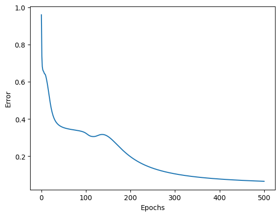
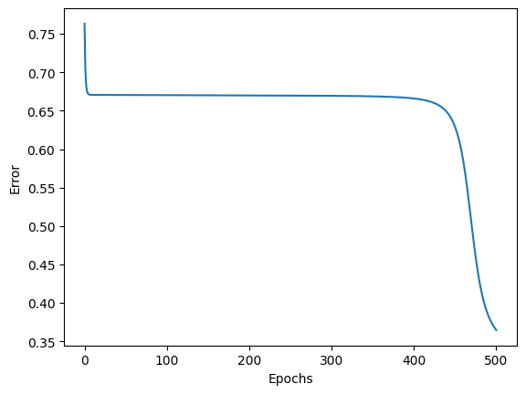
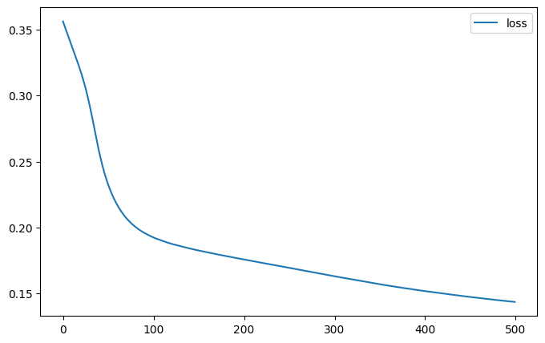
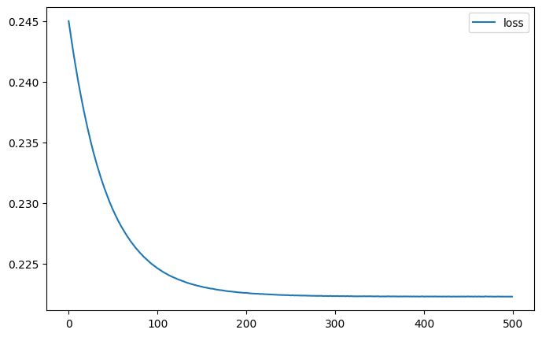

# Reporte

## Archivos notebook

- [Multilayer Perceptron — original](<01 Multilayer perceptron.ipynb>)
- [Multilayer Perceptron — modificado](01-mod_Multilayer_Perceptron.ipynb)
- [Keras — multilayer perceptron (Iris) — original](<02 Keras - multilayer perceptron - iris.ipynb>)
- [Keras — multilayer perceptron (Iris) — modificado](<02-mod Keras - multilayer perceptron - iris.ipynb>)

## Curvas de error/pérdida

### Perceptron from scratch

**Original**



**Modificado**



### Keras

**Original**



```text
┏━━━━━━━━━━━━━━━━━━━━━━━━━━━━━━━━━┳━━━━━━━━━━━━━━━━━━━━━━━━┳━━━━━━━━━━━━━━━┓
┃ Layer (type)                    ┃ Output Shape           ┃       Param # ┃
┡━━━━━━━━━━━━━━━━━━━━━━━━━━━━━━━━━╇━━━━━━━━━━━━━━━━━━━━━━━━╇━━━━━━━━━━━━━━━┩
│ layer1 (Dense)                  │ (None, 3)              │            15 │
│ layer2 (Dense)                  │ (None, 3)              │            12 │
└─────────────────────────────────┴────────────────────────┴───────────────┘
 Total params: 27 (108.00 B)
 Trainable params: 27 (108.00 B)
 Non-trainable params: 0 (0.00 B)
```

**Modificado**



```text
┏━━━━━━━━━━━━━━━━━━━━━━━━━━━━━━━━━┳━━━━━━━━━━━━━━━━━━━━━━━━┳━━━━━━━━━━━━━━━┓
┃ Layer (type)                    ┃ Output Shape           ┃       Param # ┃
┡━━━━━━━━━━━━━━━━━━━━━━━━━━━━━━━━━╇━━━━━━━━━━━━━━━━━━━━━━━━╇━━━━━━━━━━━━━━━┩
│ layer1 (Dense)                  │ (None, 3)              │            15 │
│ layer2 (Dense)                  │ (None, 3)              │            12 │
│ layer3 (Dense)                  │ (None, 3)              │            12 │
│ layer4 (Dense)                  │ (None, 3)              │            12 │
└─────────────────────────────────┴────────────────────────┴───────────────┘
 Total params: 51 (204.00 B)
 Trainable params: 51 (204.00 B)
 Non-trainable params: 0 (0.00 B)
```

## Preguntas por responder

- ¿Baja más el error al añadir dos capas, o se estancó / empeoró? ¿Igual en NumPy y en Keras?

En numpy empeoro y en Keras mejoro

- ¿Las curvas de la notebook 01 y de Keras se parecen con la misma topología? Si no, ¿qué diferencias de implementación podrían explicarlo (orden de los datos, inicialización, vectorización, etc.)?

Una conbinacion de varios factores afectan el desempeño:

 1. La relacion de actualizaciones por epocas. Keras tiene ventaja porque actualiza cada 32 epocas contra los 150 de la 01 esto hace que la curva se adapte mejor en Keras.
 2. Diferentes paradigmas de inicializacion: 01 inicializa los valores en +/- 0.5 con valores random de sesgos saturan las curvas sigmoides apiladas y Keras iniciliza los sesgos en 0 y  ademas al usar el algoritmo Glorot deja la neurona en el punto de mejor aprendizaje (queda centrado cerca de la zona donde la sigmoide tiene máxima derivada (0.25 en z=0))
 3. El dataset Iris esta ordenado: Apesar de que Iris tiene los datos ordenados por clase, Keras se encarga de combinarlos de manera uniforme de tal manera que el modelo aprende en base los pesos de las clases de flores combinadas en cambio el 01 ingesta el dataset como viene, el problema reside en que los pesos no se entrenan bien por que durante el primer tercio de la corrida ajusta sus pesos en base a un solo tipo de flor y luego cuando vienen el segundo tercio cambia a un tipo diferente de flor y los pesos cambian pero pierden la referencia de lo aprendido en el primer tercio por que ya no hay mas datos del primer tipo y lo mismo sucede en el ultimo tercio. eso hace que la funcion gradiente oscile entre un valor y otro y no descienda adecuamente.

- Con sigmoides apiladas y MSE, ¿tiene sentido que una red **más profunda** no aprenda mejor en Iris? Relaciónalo con lo que viste en las gráficas.

Si tiene sentido, por que si no se mitigan los problemas adecuadamente las neuronas no aprenden por estar saturadas esto por la propia funcion sigmoide. Distribuir uniformemente la información ademas de otras estrategias de inicializacion y de actualizacion pueden mitigar, pero no desaparecer, algunas de estas limitaciones.

## Evidencia Colab


