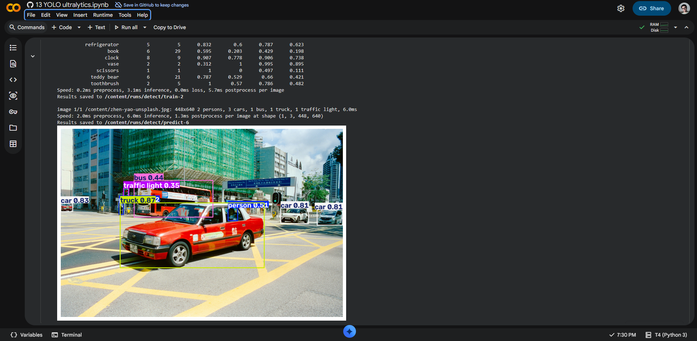

# Reporte

## Archivos notebook

- [13 YOLO ultralytics](13_YOLO_ultralytics.ipynb)

## Preguntas por responder

- ¿Qué clases detectó YOLO en las fotos de Ultralytics y cuáles en la tuya?

1. Autobus
2. Camioneta
3. Coche
4. Persona
5. Semáforo

- ¿Algún objeto evidente de tu foto **no** salió etiquetado? ¿Por qué podría pasar (clase que no está en COCO, objeto chico, recorte, umbral de confianza)?

Ninguno todos fueron identificados

- ¿La predicción de la celda CLI y la de `model(...)` coinciden sobre tu misma imagen?

No, hay un vehiculo que no se ve en la imagen o esta sobre puesta en otra etiqueta, una persona adicional al que el cli identifica.

## Evidencia Colab

