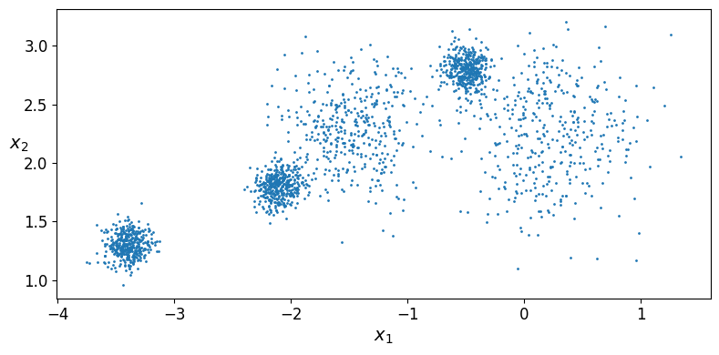
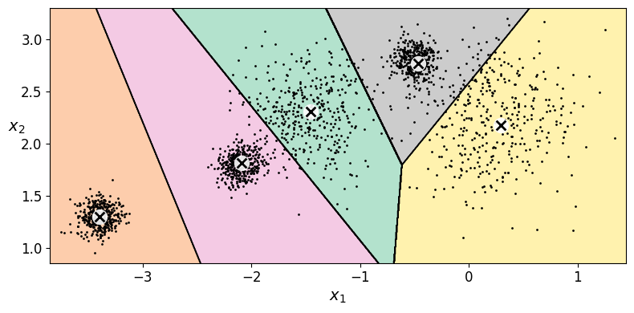
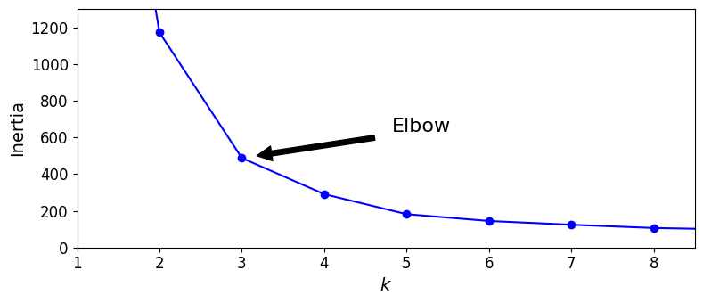

# Reporte

## Archivos notebook

- [K-Medias Modificado](01_K-medias-mod.ipynb)
- [K-Medias Original](01_K-medias.ipynb)

## Comparación de Graficas

| inercia    |  k=3   | k=5    | k=8    | silueta k=5 |
|------------|-------:|-------:|-------:|------------:|
| Original   | 653.22 | 224.07 | 127.13 |  0.6555     |
| Modificada | 487.42 | 181.56 | 106.20 |  0.5609     |

La primera imagen de cada grupo es el notebook original y la segunda es la modificada.

### Scatter de blobs

### Diagrama de Voronoi (k=5)

### Curva de codo / Inercia

### Curva de Silueta

## Evidencia Colab

