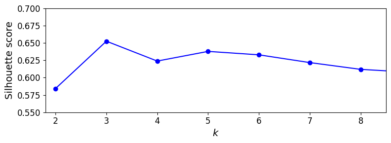
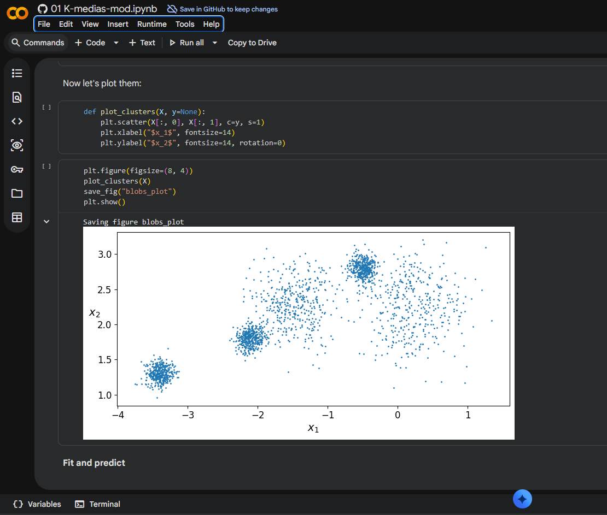

# Reporte

## Archivos notebook

- [K-Medias Modificado](01_K-medias-mod.ipynb)
- [K-Medias Original](01_K-medias.ipynb)

## Comparación de Graficas

| inercia    |  k=3   | k=5    | k=8    | silueta k=5 |
|------------|-------:|-------:|-------:|------------:|
| Original   | 653.22 | 224.07 | 127.13 |  0.6555     |
| Modificada | 487.42 | 181.56 | 106.20 |  0.5609     |

La primera imagen de cada grupo es el notebook original y la segunda es la modificada.

**Original**

    blob_centers = np.array(
      [[ 0.2,  2.3],
      [-1.5 ,  2.3],
      [-2.8,  1.8],
      [-2.8,  2.8],
      [-2.8,  1.3]])
    blob_std = np.array([0.4, 0.3, 0.1, 0.1, 0.1])

**Modificado**

    blob_centers = np.array(
      [[ 0.2,  2.3],
      [-1.5 ,  2.3],
      [-2.1,  1.8],
      [-0.5,  2.8],
      [-3.4,  1.3]])
    blob_std = np.array([0.4, 0.3, 0.1, 0.1, 0.1])

### Scatter de blobs

### Diagrama de Voronoi (k=5)

### Curva de codo / Inercia

### Curva de Silueta

## Preguntas por resolver

- En los datos de Géron, ¿por qué el codo “prefiere” (k = 4) si make_blobs usó 5 centros?

por la manera en como estan inicializados los centroides, tampoco ayuda que hay grupos que estan muy condensados el -2.8 de x. 

- Con tus blobs separados, ¿el codo y la silueta coinciden en el mismo (k)? ¿Ese (k) es 5?

si coincidieron en la misma k, pero esa K no fue 5 sino  3.

- Si el codo sigue en 4, ¿qué te falta mover (distancia entre centros vs. blob_std)?

No sigue en 4. Al separar los centros los dos blobs de mayor varianza (std 0.4 y 0.3) terminaron traslapándose entre sí, evitando ese traslape podriamos lograr que k se ajuste a 5.

## Evidencia Colab

