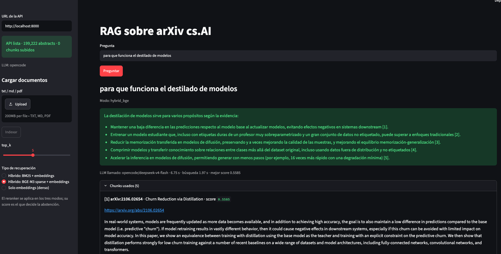
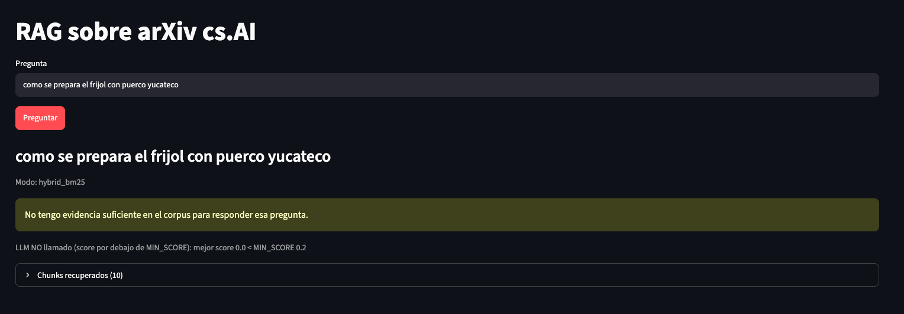
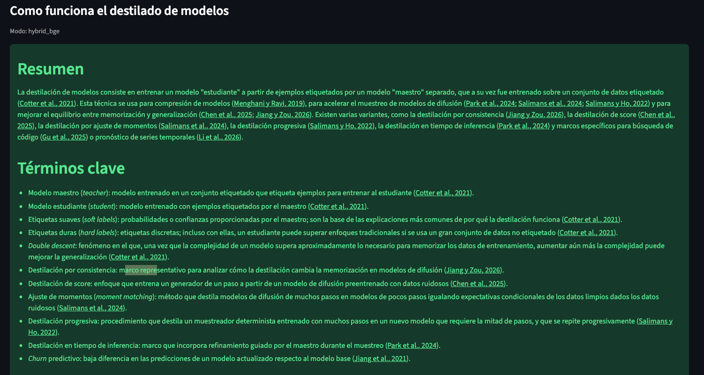
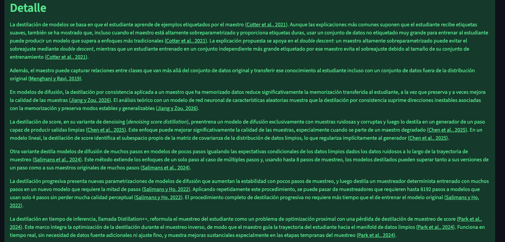
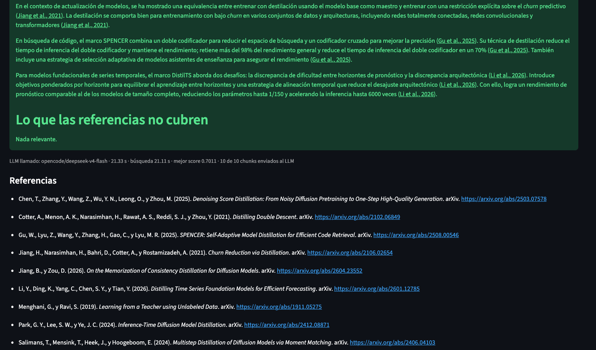
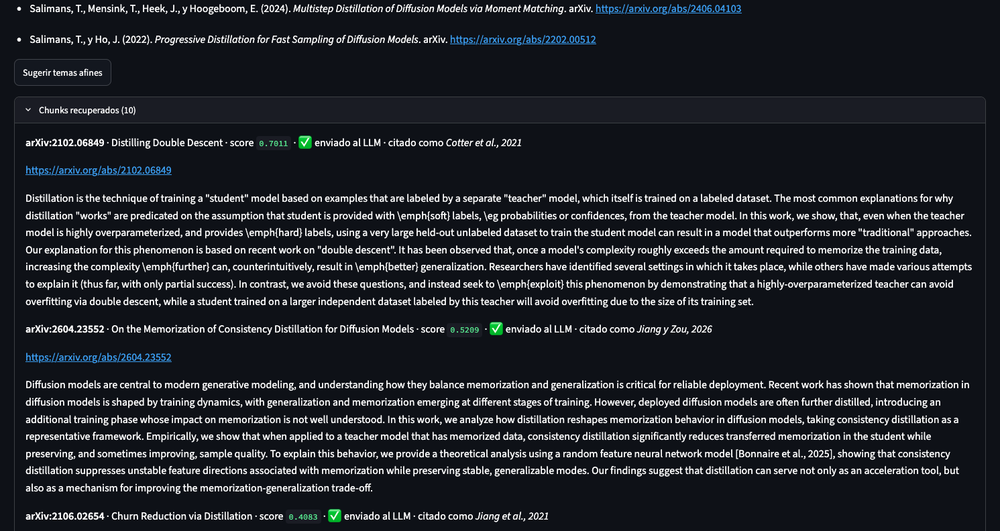
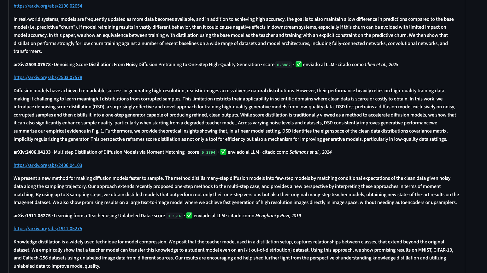
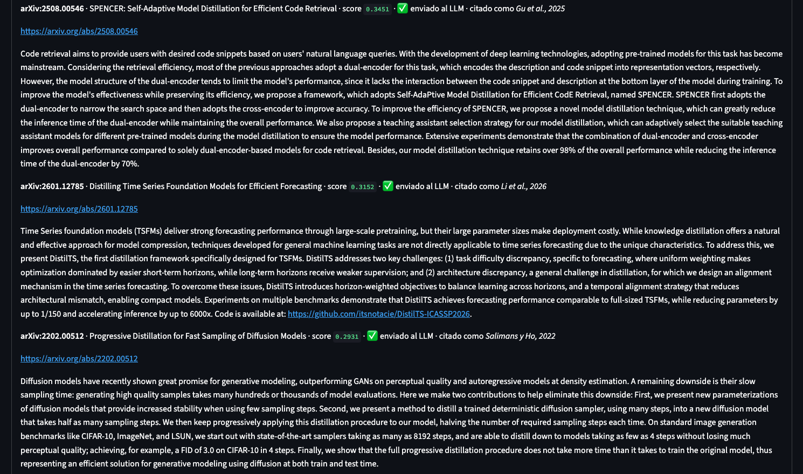
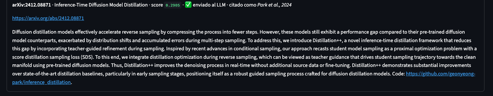

# Reporte — Sistema RAG sobre arXiv cs.AI

Proyecto final: sistema RAG con Streamlit + FastAPI + ChromaDB. Este reporte sigue los puntos de `instrucciones.md`
(dominio y corpus, chunking, abstención, papel de cada componente, evidencias y criterios de aceptación) e indica
explícitamente en qué se **adaptó** el enunciado original.

## 1. Adaptaciones respecto al enunciado

| Requerimiento | Esta implementación | Motivo |
|---|---|---|
| Embeddings con Google AI | **BAAI/bge-m3** local (vectores normalizados, coseno) | Ya existía el índice denso construido con BGE-M3 sobre ~199 mil abstracts |
| Generación con Gemini | LLM por API (**OpenCode Go**, modelo `deepseek-v4-flash`; también soporta Anthropic y OpenAI vía `.env`) | Sin Google AI |
| Recuperación densa (top-k en Chroma) | Densa, o **híbrida** (densa + sparse BM25 o sparse BGE-M3, fusión RRF) + **reranker** `bge-reranker-v2-m3` | Se comparan métodos de recuperación (ver §4) |
| Corpus de ≥ 5 documentos subidos | Corpus arXiv `cs.AI` ya indexado **y** `/ingest` para subir `.txt`, `.md` o `.pdf` a una colección aparte | El corpus arXiv sustituye al corpus de ejemplo; la ingesta de archivos se conserva |
| Citas `[n]` | Citas **APA 7** en el texto, enlazadas al artículo, y lista de referencias | Para mejorar la presentacion de resultados |

## 2. Dominio y tamaño del corpus

- **Dominio:** abstracts de artículos de arXiv de la categoría `cs.AI` (dataset `Cornell-University/arxiv`, Kaggle).
- **Tamaño:** **199 222 documentos** en la colección `arxiv_abstracts` de ChromaDB (cifra mostrada por la API en la
  barra lateral de Streamlit, ver evidencia 1). El filtro es por subcadena sobre `categories`, por lo que incluye
  artículos que tienen `cs.AI` como categoría secundaria. Cada abstract mide en promedio ~1 270 caracteres.
- **Modelo de embeddings:** `BAAI/bge-m3` para documentos y preguntas (mismo modelo en ambos lados).
- **Índices adicionales:** `bm25_index.pkl` (BM25 clásico), `bge_sparse_index.pkl` (pesos léxicos aprendidos de BGE-M3)
  y `arxiv_meta.sqlite` (autores y año para las referencias APA).
- **Corpus subido por el usuario:** colección `user_docs` en el mismo Chroma, alimentada con `POST /ingest`.

## 3. Partición en chunks

- **Abstracts de arXiv:** un abstract = un chunk (199 222 chunks). Son autocontenidos y más cortos que el tamaño de
  chunk elegido, y partirlos separaría el planteamiento de las conclusiones.
- **Documentos subidos (`/ingest`):** ventanas de **250 palabras con 50 de solape** (`app/chunk.py`, configurable con
  `CHUNK_SIZE` y `CHUNK_OVERLAP`). Dan contexto suficiente al reranker y el solape evita cortar una idea en el límite.
- Cada chunk guarda metadatos: `source`, `title` y, en los subidos, `chunk_index`.

## 4. Recuperación y comparación de los métodos sparse

**Pipeline:** embedding de la pregunta con BGE-M3 → recuperación densa en Chroma + recuperación sparse (según el modo
elegido en Streamlit) → fusión con Reciprocal Rank Fusion → reranker `bge-reranker-v2-m3` sobre los mejores candidatos →
se devuelven los `top_k` (mínimo y por defecto 10). Modos: `dense`, `hybrid_bm25` y `hybrid_bge`.

**Hallazgo del autor al comparar `hybrid_bm25` y `hybrid_bge`:** con la misma consulta sobre destilación de modelos hubo
diferencias entre ambos, y el modo BGE-M3 sparse pareció dar mejores resultados. En la respuesta generada con el modo
BM25 el modelo declaró que las referencias **no cubrían** ocho conceptos que aparecían en los documentos recuperados
(el procedimiento de optimización de la destilación estándar, la definición del fenómeno de *double descent*, qué es un
modelo de red neuronal de características aleatorias, el fundamento de la igualación de momentos, qué es el FID, la
selección de asistentes de enseñanza en SPENCER, los «modos estables e inestables» de la destilación por consistencia
y el mecanismo del muestreo antidestilación). No se puede establecer una relación clara entre varios de esos
términos y la pregunta. Con el modo BGE-M3 sparse, la sección «Lo que las referencias no cubren» de la respuesta decía
«Nada relevante» (evidencia 5). Cabe aclarar que esto es una observación con una sola consulta; no es una evaluación.
Para concluir que BGE-M3 sparse recupera mejor habría que repetir la comparación con varias preguntas 
(en español y en inglés) y comparar los chunks recuperados y sus scores.

**Posibles explicaciones (hipótesis, no verificadas):**

- BM25 es puramente léxico, con una tokenización simple (minúsculas y palabras, sin stopwords ni lematización). La
  pregunta está en español y los abstracts en inglés, así que BM25 solo puede coincidir en tokens compartidos entre
  idiomas (siglas, nombres propios) o en palabras comunes, lo que genera candidatos ruidosos que la fusión RRF mete en el
  conjunto que ve el reranker. Los pesos aprendidos de BGE-M3 sparse tienden a ponderar mejor qué tokens importan.
- La consulta en español es un factor de confusión: ambos métodos sparse coinciden por tokens, y la parte que
  realmente maneja el cruce de idiomas es la recuperación densa.

**Precauciones al interpretar la comparación:**

- La lista de «no cubren» refleja lo que el LLM declara, no directamente la calidad de la recuperación. En la respuesta
  del modo BGE, el texto de «Detalle» menciona sin definir un modelo de red neuronal de características aleatorias,
  «modos estables» y «estrategia de selección adaptativa de modelos asistentes de enseñanza» (evidencias 4 y 5), que son
  algunos de los mismos conceptos que el modo BM25 señaló como no definidos. Por eso «Nada relevante» en el modo BGE no
  prueba que sus chunks los definieran. Cabe aclarar que la informacion de los chunks esta generado a partir de textos abstract,
  dichos textos por lo general no definen ese tipo de conceptos.
- La latencia observada en el modo BGE (búsqueda de 21 s en la evidencia 5, frente a 2 s en la primera versión) se establece,
  por que se hizo una mejora a la obtencion de informacion lo que incremento el tiempo de inferencia y de procesamiento;
  la primera consulta de cada modo carga su índice `.pkl` (~0.5-1 GB), lo que probablemente influye.

## 5. Abstención y respuestas ancladas

1. **Abstención por score:** si el mejor score del reranker (0-1) es menor que `MIN_SCORE` (0.2), la API responde
   «no tengo evidencia suficiente» **sin llamar al LLM** (evidencia 2: la pregunta fuera de dominio obtuvo score 0.0).
2. **Chunks enviados al LLM:** solo los que superan `MIN_CHUNK_SCORE` (0.02). En la evidencia 5 se enviaron 10 de 10.
3. **Prompt estricto:** solo puede afirmar lo que está en la evidencia numerada, con cita en cada oración; los términos
   no definidos en las fuentes se listan en «Lo que las referencias no cubren». Si la evidencia no basta responde
   `NO_EVIDENCE` y el sistema se abstiene.
4. **Verificación en el backend:** cada oración se puntúa con el reranker contra los chunks que cita; se eliminan las
   que no tienen cita válida o respaldo suficiente (`SUPPORT_MIN_SCORE`). Si no queda ninguna, el sistema se abstiene.
   Reduce el riesgo de que el modelo use conocimiento propio, pero no es una garantía.
5. **Citas y referencias APA:** `[n]` se reemplaza por citas APA 7 en español enlazadas, y se agrega la lista de
   referencias de lo realmente citado. Las arma el código con `arxiv_meta.sqlite`, no el LLM.
6. **Temas afines a demanda:** el botón «Sugerir temas afines» llama a `POST /related`; no se generan automáticamente,
   para ahorrar tokens.

Los umbrales (`MIN_SCORE`, `MIN_CHUNK_SCORE`, `SUPPORT_MIN_SCORE`) son valores iniciales configurables en `.env`;
no se han calibrado de forma sistemática.

## 6. Qué hace cada componente

| Componente | Rol |
|---|---|
| **BGE-M3** (local) | Vectoriza documentos y preguntas; sus pesos léxicos alimentan el modo `hybrid_bge` |
| **ChromaDB** | Persiste chunks, metadatos y vectores en disco (`.chroma_db`) y devuelve los vecinos más cercanos por coseno |
| **BM25 / BGE sparse** | Recuperación léxica complementaria, fusionada con la densa mediante RRF |
| **Reranker** (local) | Reordena candidatos; su score decide la abstención y verifica las oraciones |
| **LLM por API** | Solo redacta la respuesta y los temas afines a partir de los chunks; no vectoriza |
| **FastAPI** | `/health`, `/ingest`, `/query` y `/related`; toda la lógica pasa por aquí |
| **Streamlit** | Cliente HTTP de la API: carga de archivos, selección del modo, respuesta, referencias y chunks con score |

## 7. Evidencias

**Evidencia 1 — respuesta con score y chunks (primera versión, modo `hybrid_bge`, `top_k` = 5).** La barra lateral muestra
199 222 abstracts, el LLM `opencode/deepseek-v4-flash` y el mejor score 0.5585.

**Evidencia 2 — pregunta fuera de dominio (modo `hybrid_bm25`).** «Cómo se prepara el frijol con puerco yucateco»:
mejor score 0.0 < `MIN_SCORE` 0.2, el LLM no se llama y el sistema se abstiene.

**Evidencia 3 — respuesta detallada con citas APA enlazadas (modo `hybrid_bge`, `top_k` = 10).** «Cómo funciona el destilado
de modelos»: secciones Resumen y Términos clave.

**Evidencia 4 — sección Detalle.**

**Evidencia 5 — «Lo que las referencias no cubren», métricas y referencias APA.** LLM llamado en 21.33 s, búsqueda en
21.11 s, mejor score 0.7011, 10 de 10 chunks enviados al LLM.

**Evidencia 6 — resto de referencias, botón «Sugerir temas afines» y chunks recuperados con score.** Cada chunk indica
su score, si se envió al LLM y cómo se citó (por ejemplo, 0.7011 para *Distilling Double Descent*, citado como Cotter et al., 2021).

**Evidencias 7 a 9 — chunks recuperados (scores de 0.4083 a 0.2905).**

## 8. Criterios de aceptación

| Criterio | Estado |
|---|---|
| Streamlit, FastAPI y ChromaDB en el camino crítico | Cumplido |
| Embeddings de Google AI | **No aplica** (adaptación: BGE-M3 local, ver §1) |
| Streamlit solo accede a Chroma y modelos a través de FastAPI | Cumplido (cliente HTTP) |
| Respuesta en español con citas que apuntan a chunks visibles | Cumplido (evidencias 3 a 9) |
| Reiniciar la API conserva el índice | Por diseño (Chroma persistente en `.chroma_db`); sin captura |
| Pregunta sin evidencia se abstiene | Cumplido (evidencia 2) |
| `/docs` muestra `/health`, `/ingest` y `/query` | Por diseño de FastAPI; **falta la captura** |
| Sin claves en el repositorio; README para levantar el sistema | `.env` y datos pesados en `.gitignore`; README con venv (Mac y Windows), indexación y arranque |

## 9. Limitaciones

- Los umbrales no están calibrados con un conjunto de preguntas; la comparación BM25 vs BGE-M3 sparse es cualitativa.
- El corpus son abstracts, no textos completos, por lo que las definiciones de términos técnicos suelen faltar; el
  sistema lo declara en «Lo que las referencias no cubren».
- Las preguntas en español contra abstracts en inglés dependen sobre todo de la recuperación densa y del reranker.
- La respuesta es más lenta que en la primera versión (más chunks, respuesta más larga y verificación de oraciones).
